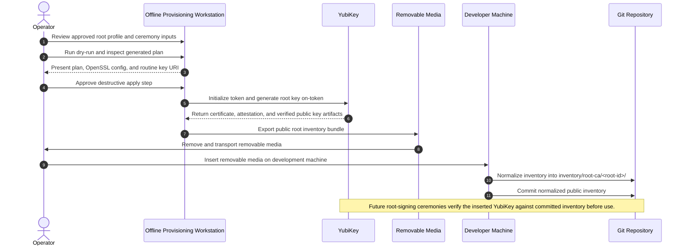

# Quickstart

## Purpose

This document is a quick operator-facing guide for provisioning a root CA
YubiKey and publishing the resulting public inventory into this repository.

This page should stay short and practical. Detailed ceremony rules,
justification, and failure handling belong in the SOPs.

## Audience

- Operators provisioning a new or approved-for-reset root CA YubiKey
- Reviewers who need the high-level ceremony flow before reading the full SOP
- Developers normalizing the exported public inventory into the repo

## Preferred Path

The preferred end-user experience is the dedicated offline provisioning
appliance and wizard.

The CLI flow remains the reference path and fallback when the wizard is not
available.

## Before You Start

- Confirm the workstation is offline and under physical control.
- Confirm the YubiKey is approved for this ceremony.
- Confirm the root initialization profile has been reviewed.
- Confirm the PIN, PUK, and management-key files are available and stored
  outside the working directory.
- Confirm removable media is available for exporting the public inventory
  bundle.

## Inputs

Document the exact inputs an operator needs before starting:

- YubiKey serial
- Root initialization profile path
- PIN file path
- PUK file path
- Management-key file path
- Local working directory
- Removable-media mount point

## High-Level Steps

### 1. Prepare The Offline Workstation

Summarize how the operator confirms that the provisioning environment is ready.

Things to cover:

- How to detect the inserted YubiKey
- How to open the provisioning shell or wizard
- Where the root initialization profile comes from
- Where temporary and archived ceremony artifacts should live

### 2. Review The Provisioning Profile

Summarize the fields that should be reviewed before any destructive action is
taken.

Things to cover:

- Subject / common name
- Validity period
- Slot selection
- Algorithm
- PIN policy
- Touch policy
- Archive location

### 3. Generate And Review The Dry-Run Plan

This section should explain that the dry-run is mandatory before the apply
step.

Suggested command skeleton:

```bash
pd-pki-signing-tools init-root-yubikey \
  --profile "$PROFILE" \
  --yubikey-serial "$YK_SERIAL" \
  --work-dir "$WORKDIR" \
  --dry-run
```

Things to cover:

- Which files are generated during dry-run
- What the operator must review
- Why the same `--work-dir` must be reused for apply

### 4. Apply The Provisioning Ceremony

This section should explain the destructive step that initializes the token and
generates the root key on-token.

Suggested command skeleton:

```bash
pd-pki-signing-tools init-root-yubikey \
  --profile "$PROFILE" \
  --yubikey-serial "$YK_SERIAL" \
  --work-dir "$WORKDIR" \
  --pin-file "$PIN_FILE" \
  --puk-file "$PUK_FILE" \
  --management-key-file "$MANAGEMENT_KEY_FILE" \
  --force-reset
```

Things to cover:

- When `--force-reset` is appropriate
- What the operator should expect during touch / authorization
- Which public artifacts are produced on success

### 5. Export The Public Inventory Bundle

This section should describe how the workstation copies the public ceremony
artifacts to removable media.

Suggested command skeleton:

```bash
pd-pki-signing-tools export-root-inventory \
  --source-dir "$ARCHIVE_DIR" \
  --out-dir "$BUNDLE_DIR"
```

Things to cover:

- Expected output directory shape
- Which files must be present in the bundle
- Which secret material must never be copied to removable media

### 6. Normalize The Inventory Into The Repository

This section should describe the development-machine step that turns the USB
bundle into committed repository inventory.

Suggested command skeleton:

```bash
pd-pki-signing-tools normalize-root-inventory \
  --source-dir "$BUNDLE_DIR" \
  --inventory-root ./inventory/root-ca
```

Things to cover:

- How `root-id` is derived
- Where the normalized inventory is written
- What should be committed versus what should remain transport-only

### 7. Verify The Key Before Future Signing Use

This section should briefly connect provisioning to later root-signing
ceremonies.

Suggested command skeleton:

```bash
pd-pki-signing-tools verify-root-yubikey-identity \
  --inventory-dir ./inventory/root-ca/<root-id> \
  --yubikey-serial "$YK_SERIAL" \
  --pin-file "$PIN_FILE" \
  --work-dir "$VERIFY_DIR"
```

Things to cover:

- Why the committed inventory is the trust anchor
- Why a serial mismatch is audit metadata, not the primary trust decision
- Where the verification summary is written

## Verification Checklist

Add a short checklist the operator can use at the end of the ceremony:

- Dry-run was reviewed before apply
- The token was initialized successfully
- The root certificate was installed and archived
- The public inventory bundle was exported to removable media
- The bundle was normalized into `inventory/root-ca/<root-id>/`
- The normalized inventory was committed to git

## Common Failure Modes

Keep this section short and link to the SOP for detail.

- YubiKey not detected
- Dry-run validation fails
- Apply step fails after reset approval
- Exported bundle is incomplete
- Normalization fails because artifact metadata does not match

## References

- [README.md](README.md)
- [Root CA Workflow Contracts](docs/ROOT_CA_WORKFLOW_CONTRACTS.md)
- [Root CA YubiKey Initialization SOP](docs/sops/ROOT_CA_YUBIKEY_INITIALIZATION_SOP.md)
- [Root CA Intermediate Signing SOP](docs/sops/ROOT_CA_INTERMEDIATE_SIGNING_SOP.md)
