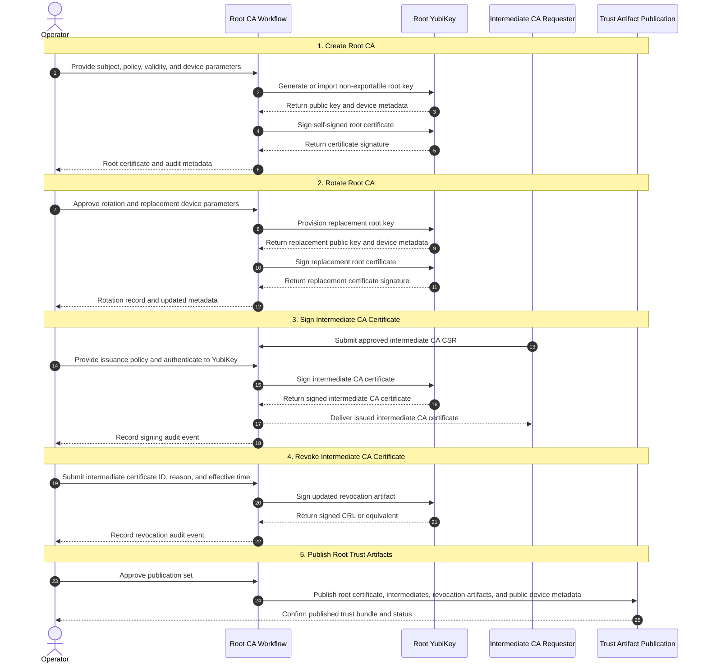

# pd-pki

Nix-based PKI infrastructure for Pseudo Design.

## Status

This repository is currently a scaffold.

Implemented today:

- Nix flake structure
- Discrete package placeholders for each PKI role
- Aggregate `pd-pki` package

Still to define:

- Certificate generation workflows
- Configuration inputs and outputs
- Build interfaces for each role
- Operational and rotation procedures

## Goals

- Manage PKI artifacts with Nix
- Separate responsibilities by certificate role
- Keep root and intermediate concerns distinct
- Support OpenVPN server and client leaf certificates

## Roles

### Root Certificate Authority

Top-level certificate authority for the PKI hierarchy. This role performs a small set of high-trust operations and should not issue OpenVPN server or client leaf certificates directly. The root signing key is intended to live on a dedicated YubiKey so root signing is hardware-backed and the private key remains non-exportable.



#### 1. Create Root CA

Inputs:

- Root subject metadata
- Root certificate profile and policy constraints
- Validity period and serial number policy
- YubiKey provisioning parameters such as key algorithm, resident slot or application, and touch policy
- A dedicated YubiKey designated for root CA use

Outputs:

- Non-exportable root private key material generated on or imported into the YubiKey
- Self-signed root CA certificate
- YubiKey device metadata needed for audit and recovery planning
- Public metadata such as fingerprint, serial number, and validity window

#### 2. Rotate Root CA

Inputs:

- Existing root CA metadata
- New root subject metadata, if changed
- New root certificate profile and policy constraints, if changed
- New YubiKey provisioning parameters
- Replacement YubiKey, if rotation moves the root to new hardware

Outputs:

- Replacement non-exportable root private key material on the YubiKey
- Replacement self-signed root CA certificate
- Updated YubiKey device metadata for trust distribution and audit records
- Retirement record for the previous root device and certificate, if applicable

#### 3. Sign Intermediate CA Certificate

Inputs:

- Approved intermediate CA certificate signing request
- Issuance policy for the intermediate CA
- Access to the root YubiKey
- Operator authentication material required to use the YubiKey
- Intermediate validity period and path length constraints

Outputs:

- Signed intermediate CA certificate
- Issuance metadata such as serial number, validity window, and policy identifiers
- Audit record of the signing event, including which YubiKey was used

#### 4. Revoke Intermediate CA Certificate

Inputs:

- Identifier for the intermediate CA certificate to revoke
- Revocation reason and effective time
- Access to the root YubiKey
- Operator authentication material required to use the YubiKey

Outputs:

- Updated revocation artifact such as a CRL
- Revocation record for audit purposes, including which YubiKey was used
- Updated public status for downstream consumers

#### 5. Publish Root Trust Artifacts

Inputs:

- Current root CA certificate
- Current signed intermediate CA certificates
- Current revocation artifacts
- Public metadata describing the active root YubiKey and signing configuration

Outputs:

- Trust bundle or distribution directory for downstream roles and clients
- Published root and intermediate public certificates
- Published revocation artifacts and supporting metadata
- Published root metadata sufficient to identify the active signing device without exposing secrets

### Intermediate Signing Authority

Signing authority delegated by the root certificate authority.

TODO:

- Define signing policy
- Define issuance inputs and outputs
- Define relationship to the root CA package

### OpenVPN Server Leaf

Leaf certificate role intended for OpenVPN server identities.

TODO:

- Define subject and SAN requirements
- Define server-specific extensions
- Define packaging/output format

### OpenVPN Client Leaf

Leaf certificate role intended for OpenVPN client identities.

TODO:

- Define subject naming approach
- Define client-specific extensions
- Define packaging/output format

## Package Layout

Current flake packages:

- `pd-pki`
- `root-certificate-authority`
- `intermediate-signing-authority`
- `openvpn-server-leaf`
- `openvpn-client-leaf`

Current source layout:

```text
.
├── flake.nix
├── packages
│   ├── default.nix
│   ├── intermediate-signing-authority.nix
│   ├── openvpn-client-leaf.nix
│   ├── openvpn-server-leaf.nix
│   └── root-certificate-authority.nix
└── README.md
```

## Usage

Examples to flesh out later:

```bash
nix build .#pd-pki
nix build .#root-certificate-authority
nix build .#intermediate-signing-authority
nix build .#openvpn-server-leaf
nix build .#openvpn-client-leaf
```

TODO:

- Document expected build outputs
- Document how inputs are supplied
- Document local development workflow

## Design Notes

Planned hierarchy:

1. Root CA
2. Intermediate signing authority
3. OpenVPN server/client leaf certificates

Questions to resolve:

- What material should be produced by each package?
- Which secrets, if any, should remain outside the Nix store?
- How should issuance inputs be parameterized?
- How should revocation and rotation be handled?

## Next Steps

- Define the interface for each package
- Decide how certificate metadata will be modeled
- Implement real derivations for certificate roles
- Add examples and verification guidance
