# pd-pki

Nix-based PKI infrastructure for Pseudo Design.

## Status

This repository is currently a scaffold.

Implemented today:

- Nix flake structure
- Discrete package placeholders for each PKI role
- Aggregate `pd-pki` package

Still to define:

- Certificate generation workflows
- Configuration inputs and outputs
- Build interfaces for each role
- Operational and rotation procedures

## Goals

- Manage PKI artifacts with Nix
- Separate responsibilities by certificate role
- Keep root and intermediate concerns distinct
- Support OpenVPN server and client leaf certificates

## Roles

### Root Certificate Authority

Top-level certificate authority for the PKI hierarchy. This role performs a small set of high-trust operations and should not issue OpenVPN server or client leaf certificates directly. The root signing key is intended to live on a dedicated YubiKey so root signing is hardware-backed and the private key remains non-exportable.

#### 1. Create Root CA

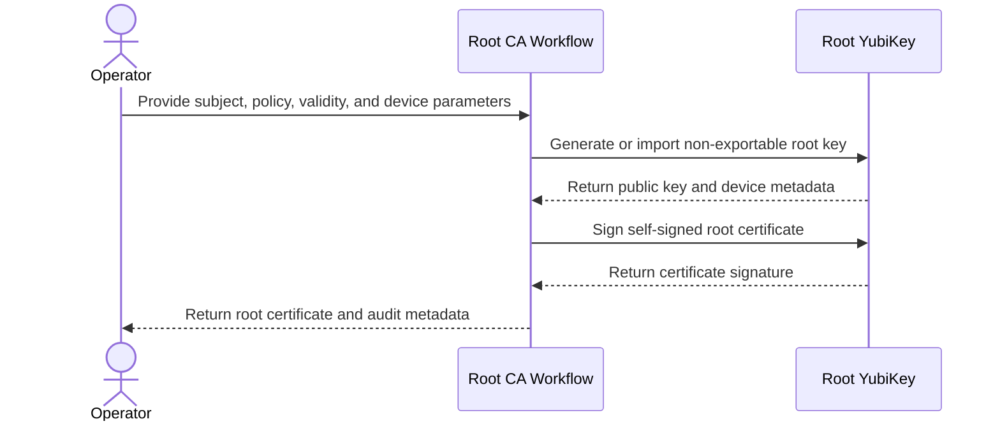

Inputs:

- Root subject metadata
- Root certificate profile and policy constraints
- Validity period and serial number policy
- YubiKey provisioning parameters such as key algorithm, resident slot or application, and touch policy
- A dedicated YubiKey designated for root CA use

Outputs:

- Non-exportable root private key material generated on or imported into the YubiKey
- Self-signed root CA certificate
- YubiKey device metadata needed for audit and recovery planning
- Public metadata such as fingerprint, serial number, and validity window

#### 2. Rotate Root CA

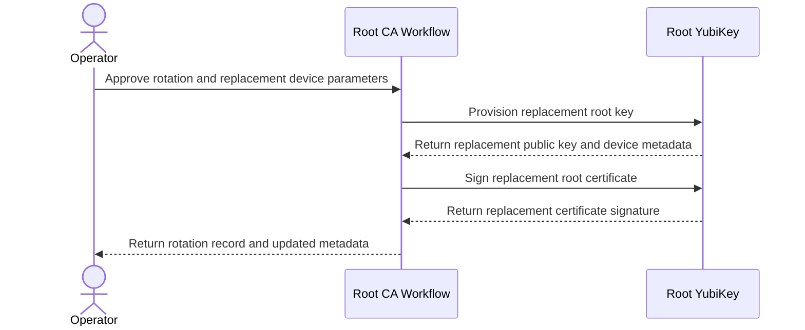

Inputs:

- Existing root CA metadata
- New root subject metadata, if changed
- New root certificate profile and policy constraints, if changed
- New YubiKey provisioning parameters
- Replacement YubiKey, if rotation moves the root to new hardware

Outputs:

- Replacement non-exportable root private key material on the YubiKey
- Replacement self-signed root CA certificate
- Updated YubiKey device metadata for trust distribution and audit records
- Retirement record for the previous root device and certificate, if applicable

#### 3. Sign Intermediate CA Certificate

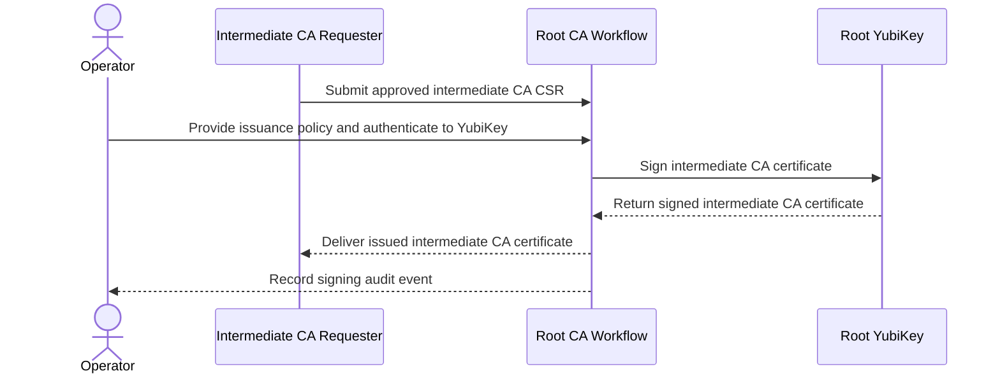

Inputs:

- Approved intermediate CA certificate signing request
- Issuance policy for the intermediate CA
- Access to the root YubiKey
- Operator authentication material required to use the YubiKey
- Intermediate validity period and path length constraints

Outputs:

- Signed intermediate CA certificate
- Issuance metadata such as serial number, validity window, and policy identifiers
- Audit record of the signing event, including which YubiKey was used

#### 4. Revoke Intermediate CA Certificate

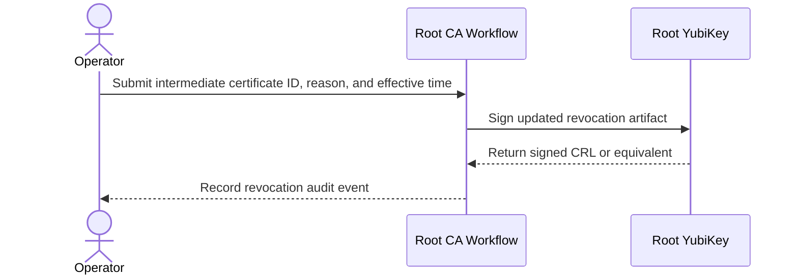

Inputs:

- Identifier for the intermediate CA certificate to revoke
- Revocation reason and effective time
- Access to the root YubiKey
- Operator authentication material required to use the YubiKey

Outputs:

- Updated revocation artifact such as a CRL
- Revocation record for audit purposes, including which YubiKey was used
- Updated public status for downstream consumers

#### 5. Publish Root Trust Artifacts

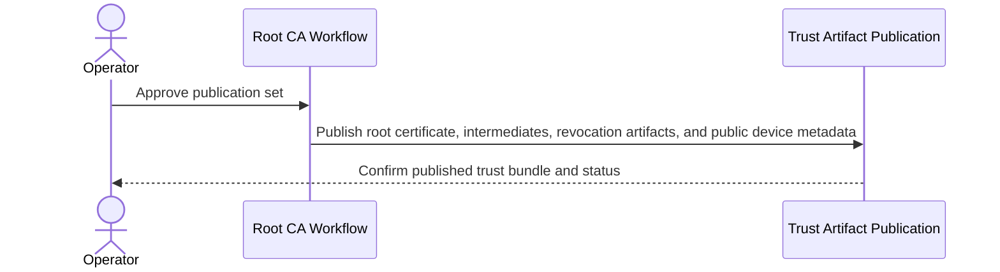

Inputs:

- Current root CA certificate
- Current signed intermediate CA certificates
- Current revocation artifacts
- Public metadata describing the active root YubiKey and signing configuration

Outputs:

- Trust bundle or distribution directory for downstream roles and clients
- Published root and intermediate public certificates
- Published revocation artifacts and supporting metadata
- Published root metadata sufficient to identify the active signing device without exposing secrets

### Intermediate Signing Authority

Delegated certificate authority signed by the root certificate authority. This role performs the higher-frequency issuance work for OpenVPN server and client leaf certificates, manages leaf revocation status, and publishes intermediate trust artifacts so the root CA can stay reserved for infrequent high-trust operations. The intermediate signing key is intended to live in a dedicated signing environment or hardware-backed device appropriate for operational issuance.

#### 1. Create Intermediate CA

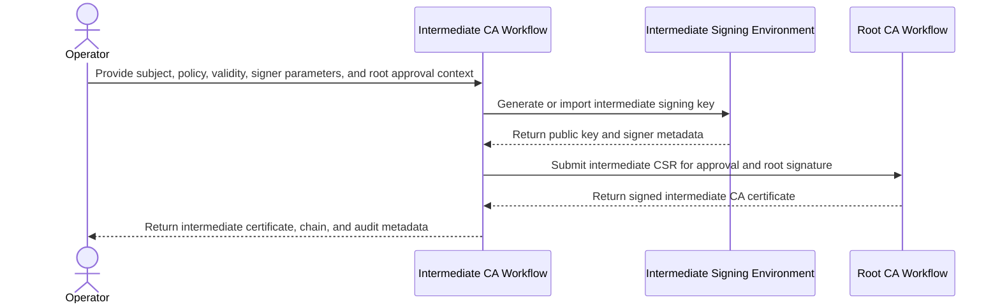

Inputs:

- Intermediate subject metadata
- Intermediate certificate profile and policy constraints
- Validity period, serial number policy, and path length constraints
- Signing environment parameters such as key algorithm, storage backend, hardware token, or service configuration
- Access to the root CA workflow needed to sign the intermediate CSR

Outputs:

- Intermediate private key material generated in the designated signing environment
- Root-signed intermediate CA certificate
- Certificate chain linking the intermediate to the root CA
- Signing environment metadata needed for audit, operations, and recovery planning

#### 2. Rotate Intermediate CA

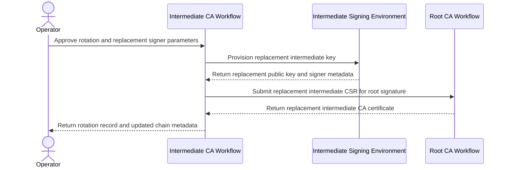

Inputs:

- Existing intermediate CA metadata
- New intermediate subject metadata, if changed
- New intermediate certificate profile and policy constraints, if changed
- New signing environment parameters
- Access to the root CA workflow to sign the replacement intermediate CSR

Outputs:

- Replacement intermediate private key material in the signing environment
- Replacement root-signed intermediate CA certificate
- Updated certificate chain and metadata for downstream trust distribution
- Retirement record for the previous intermediate key and certificate, if applicable

#### 3. Sign OpenVPN Server Leaf Certificate

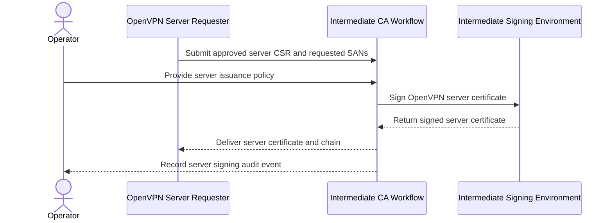

Inputs:

- Approved OpenVPN server certificate signing request
- Requested server subject alternative names and endpoint metadata
- Server issuance policy and key usage constraints
- Access to the intermediate signing environment
- Requested validity period and serial number allocation

Outputs:

- Signed OpenVPN server leaf certificate
- Issuance metadata such as serial number, validity window, and policy identifiers
- Certificate chain for server deployment
- Audit record of the signing event

#### 4. Sign OpenVPN Client Leaf Certificate

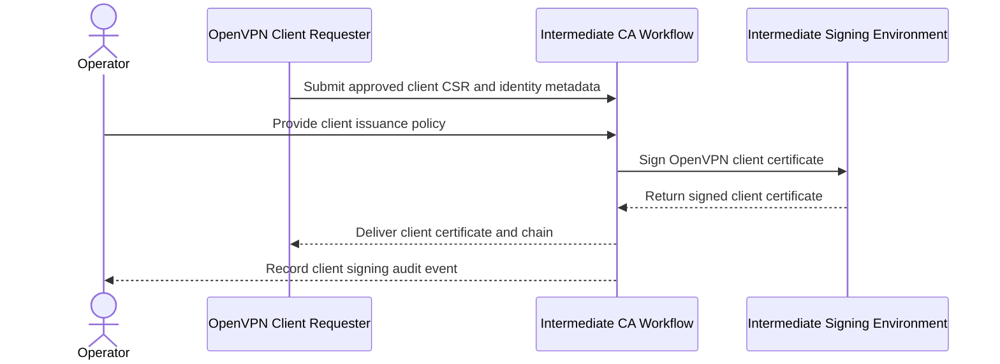

Inputs:

- Approved OpenVPN client certificate signing request
- Client identity metadata and subject naming inputs
- Client issuance policy and key usage constraints
- Access to the intermediate signing environment
- Requested validity period and serial number allocation

Outputs:

- Signed OpenVPN client leaf certificate
- Issuance metadata such as serial number, validity window, and policy identifiers
- Certificate chain for client distribution
- Audit record of the signing event

#### 5. Revoke Leaf Certificate

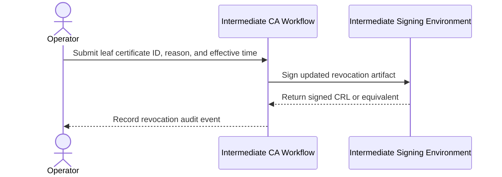

Inputs:

- Identifier for the leaf certificate to revoke
- Revocation reason and effective time
- Access to the intermediate signing environment
- Current revocation state needed to produce updated status artifacts

Outputs:

- Updated revocation artifact such as a CRL
- Revocation record for audit purposes
- Updated public status for downstream consumers
- Distribution-ready revocation metadata for OpenVPN roles

#### 6. Publish Intermediate Trust Artifacts

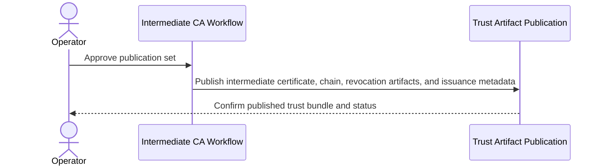

Inputs:

- Current intermediate CA certificate and root chain
- Current issued leaf certificate metadata or distribution manifests
- Current revocation artifacts
- Public metadata describing the active intermediate signing configuration

Outputs:

- Trust bundle or distribution directory for OpenVPN server and client roles
- Published intermediate and chain certificates
- Published revocation artifacts and supporting metadata
- Published issuance metadata sufficient for downstream consumers to select the active intermediate

### OpenVPN Server Leaf

Leaf certificate role intended for OpenVPN server identities. This role prepares server key material and certificate signing requests, receives signed server certificates from the intermediate signing authority, assembles deployment-ready server bundles, and manages certificate rotation inputs for ongoing service operation. The server private key is intended to remain with the target host or other server-side secret storage appropriate for the deployment.

#### 1. Create OpenVPN Server Leaf Request

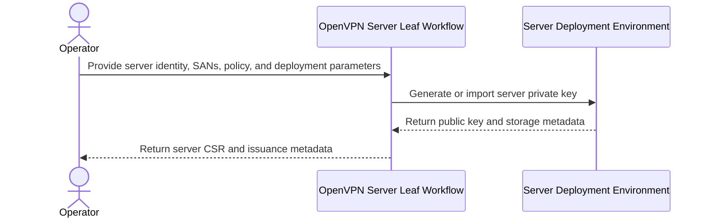

Inputs:

- Server subject metadata such as common name or service identity
- Requested subject alternative names such as DNS names or IP addresses
- Server certificate profile, key usage, and extended key usage constraints
- Key generation parameters and storage target information
- Deployment metadata describing the OpenVPN server instance or environment

Outputs:

- Server private key material generated in the designated deployment environment, or a reference to non-exportable key storage
- OpenVPN server certificate signing request
- Subject and SAN manifest for review before issuance
- Issuance request metadata for audit and downstream packaging

#### 2. Package OpenVPN Server Deployment Bundle

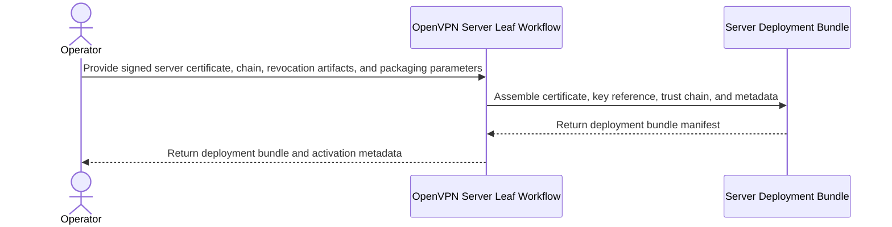

Inputs:

- Signed OpenVPN server leaf certificate
- Intermediate and root certificate chain
- Current revocation artifacts needed by the server role
- Server private key material or a reference to its storage location
- Packaging requirements such as file layout, naming, and deployment metadata

Outputs:

- Deployment-ready OpenVPN server bundle
- Server certificate and trust chain in the expected packaging format
- Bundle manifest describing serial number, validity window, and subject alternative names
- Activation metadata or configuration references for deployment automation

#### 3. Rotate OpenVPN Server Certificate

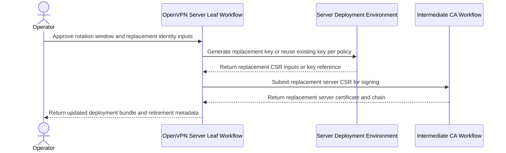

Inputs:

- Existing server certificate and deployment metadata
- New server subject or SAN inputs, if changed
- Rotation policy indicating whether to rekey or reuse the existing key
- Access to the server deployment environment and the intermediate signing workflow
- Replacement validity period and activation window

Outputs:

- Replacement server private key material or a record that the existing key was reused
- Replacement signed OpenVPN server certificate and chain
- Updated deployment bundle and rollout metadata
- Retirement record for the previous certificate and key material, if applicable

#### 4. Consume Server Trust Updates

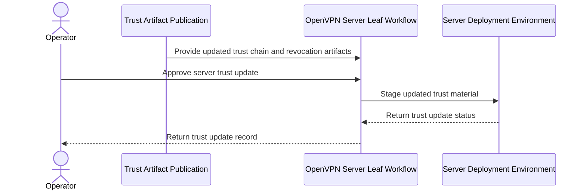

Inputs:

- Current published root and intermediate trust bundle
- Current revocation artifacts
- Metadata describing the target server deployment environment
- Update policy and activation window for trust changes

Outputs:

- Updated trust material for server-side certificate validation
- Deployment record showing when the trust bundle changed
- Status metadata indicating the active trust and revocation set
- Inputs required for subsequent server bundle refreshes, if applicable

### OpenVPN Client Leaf

Leaf certificate role intended for OpenVPN client identities. This role prepares per-user or per-device key material and certificate signing requests, receives signed client certificates from the intermediate signing authority, assembles distribution-ready client credential bundles, and manages certificate rotation inputs for client access. The client private key is intended to remain on the endpoint device or in a user-held hardware token when that deployment model is used.

#### 1. Create OpenVPN Client Leaf Request

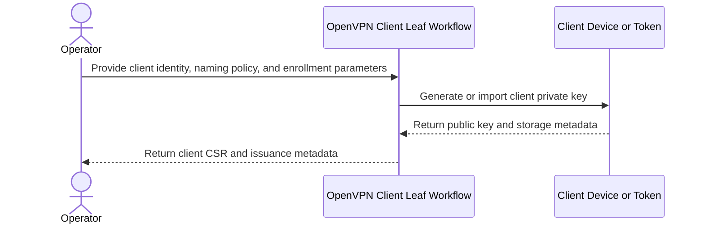

Inputs:

- Client identity metadata such as user, device, or service account attributes
- Subject naming policy inputs used to construct the client certificate subject
- Client certificate profile, key usage, and extended key usage constraints
- Key generation parameters and client-side storage target information
- Enrollment metadata describing the client device, token, or distribution channel

Outputs:

- Client private key material generated on the endpoint or in the designated token, or a reference to non-exportable key storage
- OpenVPN client certificate signing request
- Identity manifest describing the requested subject and related client metadata
- Issuance request metadata for audit and downstream packaging

#### 2. Package OpenVPN Client Credential Bundle

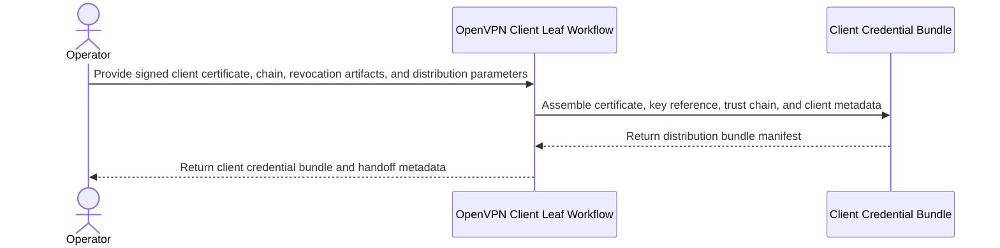

Inputs:

- Signed OpenVPN client leaf certificate
- Intermediate and root certificate chain
- Current revocation artifacts needed by the client role
- Client private key material or a reference to its storage location
- Distribution requirements such as archive format, file layout, and client configuration metadata

Outputs:

- Distribution-ready OpenVPN client credential bundle
- Client certificate and trust chain in the expected packaging format
- Bundle manifest describing serial number, validity window, and client identity metadata
- Handoff metadata or configuration references for client onboarding

#### 3. Rotate OpenVPN Client Certificate

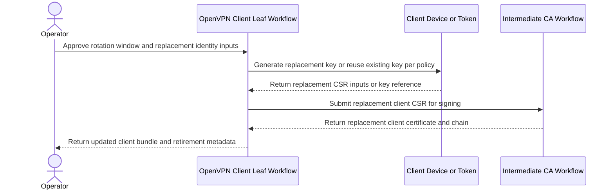

Inputs:

- Existing client certificate and distribution metadata
- New client identity or subject naming inputs, if changed
- Rotation policy indicating whether to rekey or reuse the existing key
- Access to the client device or token and the intermediate signing workflow
- Replacement validity period and activation window

Outputs:

- Replacement client private key material or a record that the existing key was reused
- Replacement signed OpenVPN client certificate and chain
- Updated credential bundle and rollout metadata
- Retirement record for the previous certificate and key material, if applicable

#### 4. Consume Client Trust Updates

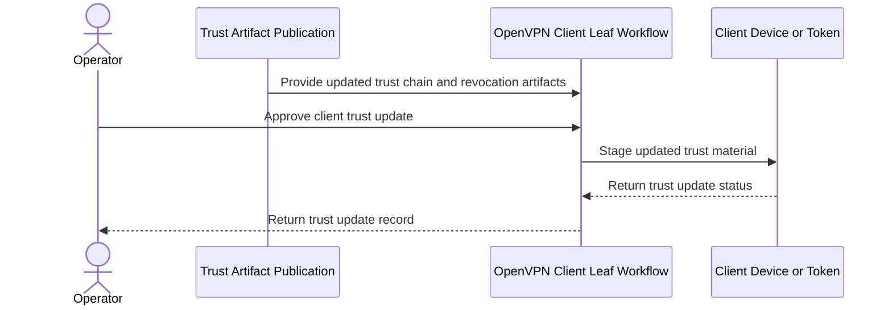

Inputs:

- Current published root and intermediate trust bundle
- Current revocation artifacts
- Metadata describing the target client device, token, or distribution channel
- Update policy and activation window for trust changes

Outputs:

- Updated trust material for client-side certificate validation
- Distribution record showing when the trust bundle changed
- Status metadata indicating the active trust and revocation set
- Inputs required for subsequent client bundle refreshes, if applicable

## Package Layout

Current flake packages:

- `pd-pki`
- `root-certificate-authority`
- `intermediate-signing-authority`
- `openvpn-server-leaf`
- `openvpn-client-leaf`

Current source layout:

```text
.
├── flake.nix
├── packages
│   ├── default.nix
│   ├── intermediate-signing-authority.nix
│   ├── openvpn-client-leaf.nix
│   ├── openvpn-server-leaf.nix
│   └── root-certificate-authority.nix
└── README.md
```

## Usage

Examples to flesh out later:

```bash
nix build .#pd-pki
nix build .#root-certificate-authority
nix build .#intermediate-signing-authority
nix build .#openvpn-server-leaf
nix build .#openvpn-client-leaf
nix flake check -L --keep-going
nix run .#test-report
nix run .#test-report -- --verbose
```

TODO:

- Document expected build outputs
- Document how inputs are supplied
- Document local development workflow

## Design Notes

Planned hierarchy:

1. Root CA
2. Intermediate signing authority
3. OpenVPN server/client leaf certificates

Questions to resolve:

- What material should be produced by each package?
- Which secrets, if any, should remain outside the Nix store?
- How should issuance inputs be parameterized?
- How should revocation and rotation be handled?

## Next Steps

- Define the interface for each package
- Decide how certificate metadata will be modeled
- Implement real derivations for certificate roles
- Add examples and verification guidance
